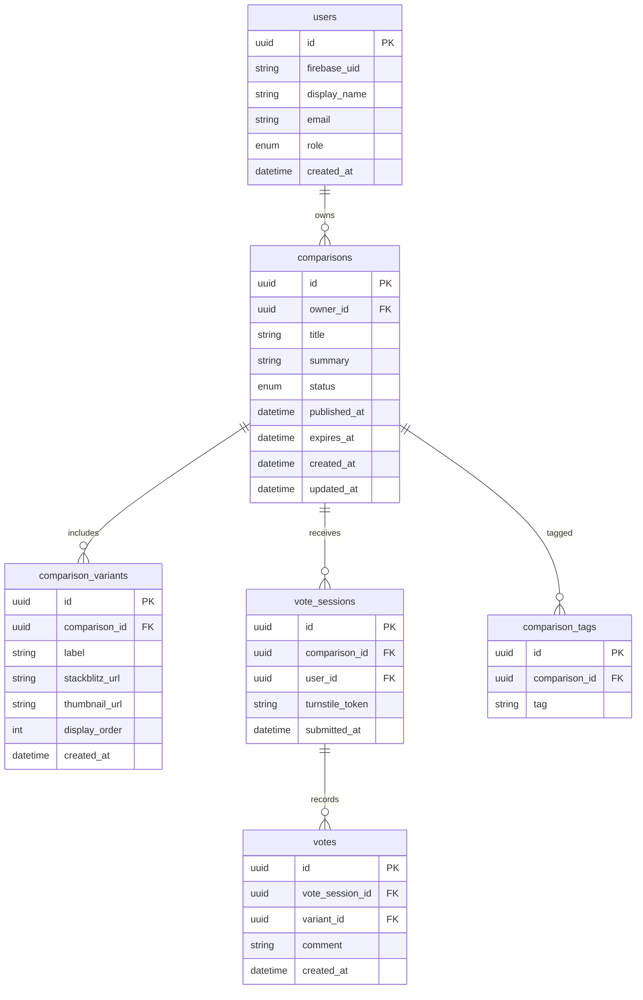
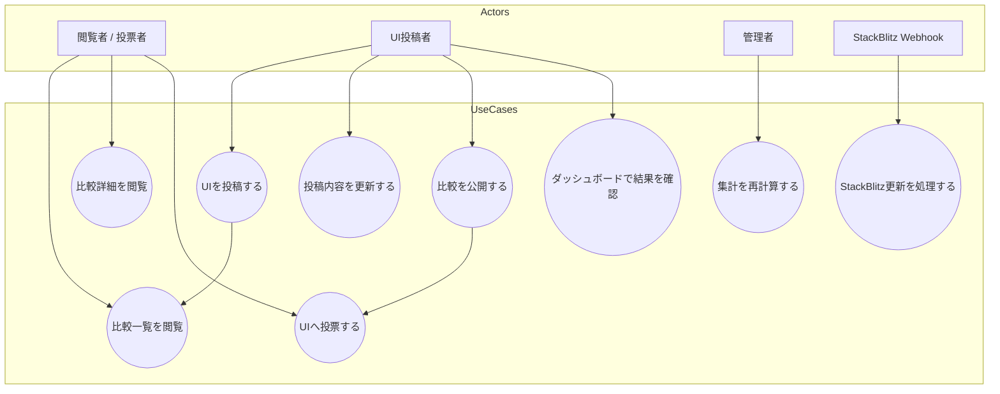
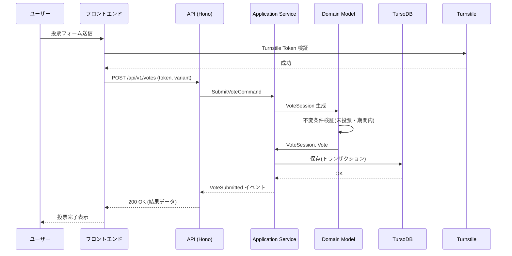

# 図表集

## 1. ERD (Entity Relationship Diagram)
UI比較投票アプリにおける主要テーブルとリレーションを示す。

## 2. ユースケース図 (Actors & Use Cases)
主要アクターとユースケースの関係を示す。

## 3. 投票シーケンス図
`SubmitVote` ユースケースの代表的なシーケンスを示す。

これらの図表は `specs/domain-model.md` および `specs/use-cases.md` と併せて使用し、開発時の参照とする。
