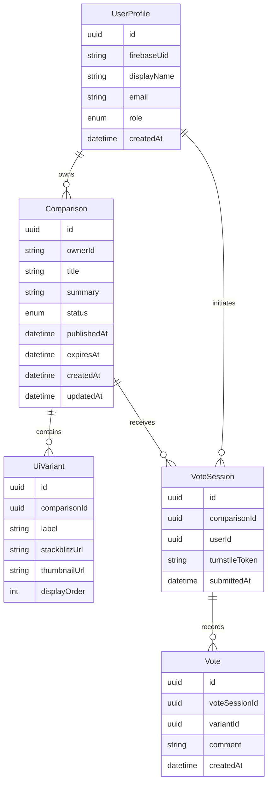

# DDDドメインモデル図

UI比較投票アプリのドメインを Comparison / Voting / User のバウンデッドコンテキストに分割し、主要エンティティ・値オブジェクト・集約の構造を以下にまとめる。

## 1. バウンデッドコンテキスト概要
- **Comparison コンテキスト**
  - Aggregate Root: `Comparison`
  - 子エンティティ: `UiVariant`
  - ドメインイベント: `ComparisonCreated`, `ComparisonPublished`, `ComparisonUpdated`, `ComparisonClosed`
- **Voting コンテキスト**
  - Aggregate Root: `VoteSession`
  - 関連エンティティ: `Vote`
  - ドメインイベント: `VoteSubmitted`, `VoteRejected`
- **User コンテキスト**
  - エンティティ: `UserProfile`
  - ドメインイベント: `UserRegistered`, `UserRoleChanged`

## 2. クラス図（Mermaid）

## 3. 値オブジェクト
- `VariantLabel`: 1〜40文字、重複不可
- `StackBlitzUrl`: `https://stackblitz.com/...` パターンのみ許可
- `ComparisonStatus`: `draft | published | closed`
- `SelectedVariant`: `variant-1` 〜 `variant-4`
- `VoteLimitPolicy`: 1ユーザ1案件1投票、Turnstile検証が成功していること

## 4. 主要不変条件
1. `Comparison` に紐づく `UiVariant` は2〜4件
2. `UiVariant` の `displayOrder` は 1 から連番で重複なし
3. `VoteSession` は同一 `comparisonId` + `userId` の組み合わせで一意
4. `Vote` は `VoteSession` に必ず1件（単一選択）
5. `Comparison` の公開期間内のみ `VoteSession` が作成できる

## 5. ドメインイベントの利用
- `ComparisonPublished`
  - 発火条件: ステータスが draft → published
  - 目的: 通知やStackBlitzメタ情報のキャッシュ更新
- `VoteSubmitted`
  - 発火条件: VoteSession + Vote が正しく保存された時
  - 目的: 集計キャッシュ更新、異常検知への入力

## 6. 集約境界と一貫性
- `Comparison` 集約は `UiVariant` までを強整合性で抱える
- `VoteSession` 集約は `Vote` を包含し、最終的な得票集計はクエリモデルで eventual consistency を許容
- `UserProfile` は Firebase をソースオブトゥルースとし、補助情報のみ保持

## 7. コンテキスト間連携
- `Comparison` と `Voting` は `ComparisonPublished` イベントを介して同期。投票可能期間やUI構成はイベントから更新
- `UserProfile` は Firebase IDトークン検証時に生成/更新され、所有権・アクセス制御に利用

このモデル図をもとに、アプリケーション層のユースケース設計とリポジトリ実装を進める。
